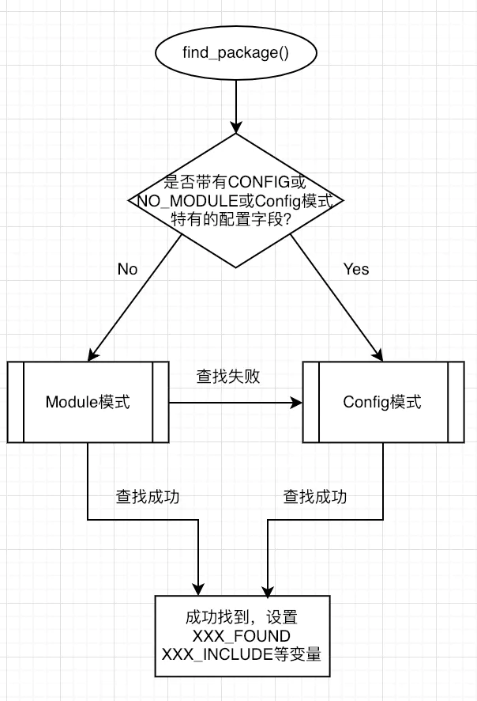

# 声明要求的cmake最低版本
```cmake
cmake_minimum_required(VERSION 2.8)
```

# 声明一个cmake工程

```cmake
project(HelloSLAM)
```

# add_subdirectory
> 包含子项目。 多层目录 01是子目录,里面有自己的cmakelist.txt

`add_subdirectory("01")`

# add_executable
> 添加一个可执行程序

```cmake
add_executable(程序名 源代码文件)
add_executable(helloSLAM helloSLAM.cpp)
```

# set

`SET(VAR [VALUE] [CACHE TYPE DOCSTRING [FORCE]]) `

> 用来显式的定义变量 

> 例子

`set(libs "${CMAKE_SOURCE_DIR}/src/main/jnilibs")`

> 定义了一个变量libs，并且变量的值为${CMAKE_SOURCE_DIR}/src/main/jnilibs，其中CMAKE_SOURCE_DIR 是一个cmake内置变量，指定了CMakeLists.txt所在的目录。详细介绍可参考：http://www.cnblogs.com/xianghang123/p/3556425.html。

`set(CMAKE_LIBRARY_OUTPUT_DIRECTORY ${PROJECT_SOURCE_DIR}/src/main/jnilibs/${ANDROID_ABI})`

> 这个命令用于给CMAKE_LIBRARY_OUTPUT_DIRECTORY宏赋值，该宏指定了cmake编译输出的东西应该放在什么地方。
>
> 这个例子中的地方是\${PROJECT_SOURCE_DIR}/src/main/jnilibs/${ANDROID_ABI}
>
> 其中PROJECT_SOURCE_DIR 是cmake内置宏，指向构建工程的全路径。详细介绍可参考https://www.cnblogs.com/alphagl/p/6280061.html

```cmake
set(CMAKE_CXX_STANDARD 11)
```


# include_directories(路径)

> 指定头文件目录
>
> 它相当于g++选项中的-I参数的作用，也相当于环境变量中增加路径到CPLUS_INCLUDE_PATH变量的作用(这里特指c++。c和Java中用法类似)
>
> 比如:

```cmake
include_directories("~/libtorch/include")
与
export CPLUS_INCLUDE_PATH=CPLUS_INCLUDE_PATH:~/libtorch/include
```

> 例子

```cmake
include_directories("D:/ai/libtorch/include" "D:/ai/libtorch/include/torch/csrc/api/include")
```


# link_directories(路径)

`link_directories(directory1 directory2 …)`

> 该指令的作用主要是指定要链接的库文件的路径，该指令有时候不一定需要。因为find_package和find_library指令可以得到库文件的绝对路径。
>
> 不过你自己写的动态库文件放在自己新建的目录下时，可以用该指令指定该目录的路径以便工程能够找到。
>
> 它相当于g++命令的-L选项的作用，也相当于环境变量中增加LD_LIBRARY_PATH的路径的作用。

> 例子

```cmake
link_directories("D:/ai/libtorch/iib")
```


# link_libraries(文件)

`target_link_libraries([item1] [item2] [...]`

> 添加需要链接的库文件路径，注意这里是全路径

```cmake
link_libraries("/opt/MATLAB/R2012a/bin/glnxa64/libeng.so"　"/opt/MATLAB/R2012a/bin/glnxa64/libmx.so")
```


# target_link_libraries

`target_link_libraries(<target> [item1] [item2] [...]`

> 为将目标文件与库文件进行链接

```cmake
target_link_libraries(helloSLAM hello.so)  #连接libhello.so库
```


#　add_library

>　将指定的源文件生成链接文件，然后添加到工程中去

```cmake
add_library(库名称 源代码文件)，会生成 lib库名称.a(静态库)
add_library(库名称 SHARED 源代码文件)，会生成 lib库名称.so(共享库)
add_library(hello libHelloSLAM.cpp)
```


# find_package

`find_package( <name> [version] [EXACT] [QUIET] [NO_MODULE] [ [ REQUIRED | COMPONENTS ] [ componets... ] ] )`

> find_package()有Module模式(基本用法，basic signature)和Config模式(full signature，完全用法），其中Module模式是基础，Config模式则更复杂高级些。
>
> #### 区分Module模式和Config模式
>
> Module模式也就是基础用法(Basic Signature，这里Signature表示“用法”，而不是“签名”），Config模式也就是高级用法（Full Signature）。
>
> The CONFIG option, the synonymous NO_MODULE option, or the use of  options not specified in the basic signature all enforce pure Config  mode. In pure Config mode, the command skips Module mode search and  proceeds at once with Config mode search.
>
> 也就是说，只有这3种情况下才是Config模式：
>
> - find_package()中指定CONFIG关键字
> - find_package()中指定NO_MODULE关键字
> - find_package()中使用了不在"basic signature"(也就是Module模式下所有支持的配置）关键字
>
> 换句话说，只要我不指定"CONFIG"，不指定“NO_MODULE"，也不使用"full signature"中的关键字，那我就是在Module模式。排查find_package()的第一步，应当判断它是Module模式还是Config模式。



## Module模式下find_package()的用法

```css
find_package(<PackageName> [version] [EXACT] [QUIET] [MODULE]
```

Module模式下，相比于Config模式，可选配置参数少一些，并且如果按用户指定的配置却找不到包，就会自动进入Config模式（如上图所示）。

### 关键字解释

version和EXACT: 都是可选的，version指定的是版本，如果指定就必须检查找到的包的版本是否和version兼容。如果指定EXACT则表示必须完全匹配的版本而不是兼容版本就可以。

- QUIET 可选字段，表示如果查找失败，不会在屏幕进行输出（但是如果指定了REQUIRED字段，则QUIET无效，仍然会输出查找失败提示语）。

- MODULE 可选字段。前面提到说“如果Module模式查找失败则回退到Config模式进行查找”，但是假如设定了MODULE选项，那么就只在Module模式查找，如果Module模式下查找失败并不回落到Config模式查找。

- REQUIRED可选字段。表示一定要找到包，找不到的话就立即停掉整个cmake。而如果不指定REQUIRED则cmake会继续执行。

- COMPONENTS，components:可选字段，表示查找的包中必须要找到的组件(components），如果有任何一个找不到就算失败，类似于REQUIRED，导致cmake停止执行。

- OPTIONAL_COMPONENTS和components：可选的模块，找不到也不会让cmake停止执行。

### Module模式查找顺序

Module模式下是要查找到名为Find.cmake的文件。

先在CMAKE_MODULE_PATH变量对应的路径中查找。如果路径为空，或者路径中查找失败，则在cmake module directory（cmake安装时的Modules目录，比如/usr/local/share/cmake/Modules）查找。

## Config模式下find_package()的用法

```cmake
find_package(<PackageName> [version] [EXACT] [QUIET]
[REQUIRED] [[COMPONENTS] [components...]]
[CONFIG|NO_MODULE]
[NO_POLICY_SCOPE]
[NAMES name1 [name2 ...]]
[CONFIGS config1 [config2 ...]]
[HINTS path1 [path2 ... ]]
[PATHS path1 [path2 ... ]]
[PATH_SUFFIXES suffix1 [suffix2 ...]]
[NO_DEFAULT_PATH]
[NO_PACKAGE_ROOT_PATH]
[NO_CMAKE_PATH]
[NO_CMAKE_ENVIRONMENT_PATH]
[NO_SYSTEM_ENVIRONMENT_PATH]
[NO_CMAKE_PACKAGE_REGISTRY]
[NO_CMAKE_BUILDS_PATH] # Deprecated; does nothing.
[NO_CMAKE_SYSTEM_PATH]
[NO_CMAKE_SYSTEM_PACKAGE_REGISTRY]
[CMAKE_FIND_ROOT_PATH_BOTH |
ONLY_CMAKE_FIND_ROOT_PATH |
NO_CMAKE_FIND_ROOT_PATH])
```

Config模式下的查找顺序，比Module模式下要多得多。而且，新版本的CMake比老版本的有更多的查找顺序（新增的在最优先的查找顺序）。它要找的文件名字也不一样，Config模式要找Config.cmake或-config.cmake。查找顺序为：

1. 名为_ROOT的cmake变量或环境变量。CMake3.12新增。设定CMP0074 Policy来关闭。
    注意：如果定义了_DIR cmake变量，那么_ROOT 不起作用。举例：

```cmake
cmake_minimum_required(VERSION 3.13)

project(fk_cmk)

set(OpenCV_ROOT "F:/zhangzhuo/lib/opencv_249/build")

set(OpenCV_DIR "F:/zhangzhuo/lib/opencv_300/build")

find_package(OpenCV QUIET
    NO_MODULE
    NO_DEFAULT_PATH
    NO_CMAKE_PATH
    NO_CMAKE_ENVIRONMENT_PATH
    NO_SYSTEM_ENVIRONMENT_PATH
    NO_CMAKE_PACKAGE_REGISTRY
    NO_CMAKE_BUILDS_PATH
    NO_CMAKE_SYSTEM_PATH
    NO_CMAKE_SYSTEM_PACKAGE_REGISTRY
)

message(STATUS "OpenCV library status:")
message(STATUS "    version: ${OpenCV_VERSION}")
message(STATUS "    libraries: ${OpenCV_LIBS}")
message(STATUS "    include path: ${OpenCV_INCLUDE_DIRS}")
```

实际上会找到opencv300，也就是OpenCV_DIR这一cmake变量的值最先起作用。

2. cmake特定的缓存变量：

```cmake
CMAKE_PREFIX_PATH
CMAKE_FRAMEWORK_PATH
CMAKE_APPBUNDLE_PATH
可以通过设定NO_CMAKE_PATH来关闭这一查找顺序
```

3. cmake特定的环境变量

```cmake
<PackageName>_DIR
CMAKE_PREFIX_PATH
CMAKE_FRAMEWORK_PATH
CMAKE_APPBUNDLE_PATH
可以通过NO_CMAKE_ENVIRONMENT_PATH来跳过。
```

4. HINT字段指定的路径

5. 搜索标准的系统环境变量PATH。
    其中如果是以/bin或者/sbin结尾的，会自动转化为其父目录。
    通过指定NO_SYSTEM_ENVIRONMENT_PATH来跳过。

6. 存储在cmake的"User Package Registry"(用户包注册表)中的路径。
    通过设定NO_CMAKE_PACKAGE_REGISTRY，或者：
    设定CMAKE_FIND_PACKAGE_NO_PACKAGE_REGISTRY为true，
    来避开。

7. 设定为当前系统定义的cmake变量：

```cmake
CMAKE_SYSTEM_PREFIX_PATH
CMAKE_SYSTEM_FRAMEWORK_PATH
CMAKE_SYSTEM_APPBUNDLE_PATH
通过设定NO_CMAKE_SYSTEM_PATH来跳过
```

8. 在cmake的"System Package Registry"(系统包注册表）中查找。
    通过设定NO_CMAKE_SYSTEM_PACKAGE_REGISTRY跳过。
    或者通过设定CMAKE_FIND_PACKAGE_NO_SYSTEM_PACKAGE_REGISTRY为true。

9. 从PATHS字段指定的路径中查找。

> `<package>_FOUND` 将被设置为指示是否找到该软件包。

```cmake
find_package(BZip2)
if (BZIP2_FOUND)
  include_directories(${BZIP_INCLUDE_DIRS})
  target_link_libraries (helloworld ${BZIP2_LIBRARIES})
endif (BZIP2_FOUND)
```

> 默认查找目录：

```cmake
<package>_DIR
CMAKE_PREFIX_PATH
CMAKE_FRAMEWORK_PATH
CMAKE_APPBUNDLE_PATH
PATH
```

# find_library

`find_library(<VAR> name1 [path1 path2 ...])`

> 在指定目录下搜索一个库, 保存在变量MY_LIB中

`find_library(MY_LIB libmylib.a ./)`

> 寻找系统库，比如：寻找 log库

`find_library(log-lib log)`

> 指定路径寻找库，比如：在当前目录下寻找libmylib.so动态库。

`find_library(my_lib libmylib.so ./)`


# if() endif() _FOUND message

```cmake
find_package(Torch REQUIRED)
if (Torch_FOUND)
    message("Torch found!")
endif ()
```


# win

> CLion编译的程序是用cmake方法编译的，在windows上exe文件需要libgcc才能运行
>
> 解决方法
>
> 修改CMAKElist文件，添加让链接器静态链接libgcc和libstdc++的指令

```cmake
set(CMAKE_EXE_LINKER_FLAGS "-static-libgcc -static-libstdc++")
或 
set(CMAKE_EXE_LINKER_FLAGS "-static")
```


# libtorch

> linux

```cmake
cmake_minimum_required(VERSION 3.21)
project(test)
set(CMAKE_CXX_STANDARD 14)

add_executable(test main.cpp)

# cuda
set(CMAKE_CUDA_COMPILER "/usr/local/cuda/bin/nvcc")

set(Torch_DIR "/home/ubuntu/libtorch/share/cmake/Torch")
set(CMAKE_PREFIX_PATH "/home/ubuntu/libtorch/share/cmake/Torch")
find_package(Torch REQUIRED)
if (Torch_FOUND)
    message("Torch found!")
endif ()

include_directories("/home/ubuntu/libtorch/include" "/home/ubuntu/libtorch/include/torch/csrc/api/include")
link_directories("/home/ubuntu/libtorch/lib")

target_link_libraries(test ${Torch_LIBS})
```

> win

```cmake
cmake_minimum_required(VERSION 3.21)
project(test)
set(CMAKE_CXX_STANDARD 14)

add_executable(test main.cpp)

# cuda
set(CMAKE_CUDA_COMPILER "C:/Program Files/NVIDIA GPU Computing Toolkit/CUDA/v11.3/bin/nvcc.exe")

set(Torch_DIR "D:/ai/libtorch/share/cmake/Torch")
set(CMAKE_PREFIX_PATH "D:/ai/libtorch")
find_package(Torch REQUIRED)
if (Torch_FOUND)
    message("Torch found!")
endif ()

include_directories("D:/ai/libtorch/include" "D:/ai/libtorch/include/torch/csrc/api/include")
link_directories("D:/ai/libtorch/lib")

target_link_libraries(test ${Torch_LIBS})
```